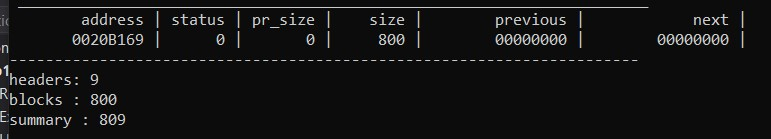
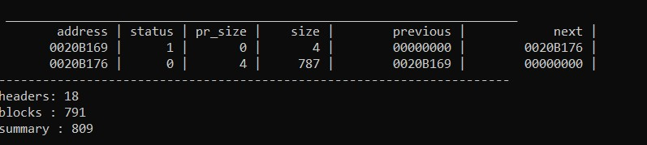
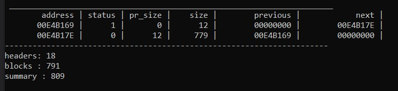
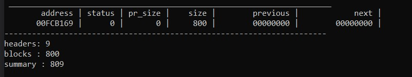

### Brief description
A test of implementing the basic work mechanic of memory allocators (not actually implementing the allocator).  
In C and C++, it can be very convenient to allocate and de-allocate blocks of memory as and when needed. 
This is certainly standard practice in both languages and almost unavoidable in C++. However, the handling of such dynamic memory can be problematic and inefficient. 
For desktop applications, where memory is freely available, these difficulties can be ignored. 
For embedded - generally real time - applications, ignoring the issues is not an option.
The function uses the pointer arithmetic to move between the blocks.

Each block has a **header** and the **data**. **Header** always has a fixed size of 9 bytes.   
That means, to allocate ***9 bytes*** of memory, we need at least ***18 bytes*** of free memory.
The structure of **header**:   
> **[current block size : 4 bytes | previous block size : 4 bytes | data is occupied : 1 byte ]**
### Algorithm description   
#### `void* mem_alloc(size_t size)` function
When the `mem_alloc` function is called,
it searches for the smallest block of free memory, satisfying the `size` criteria (the size of that free block has to be at least `size + HEADER_SIZE`).
If it found such - it splits the block into the 'taken for allocation memory' block and the 'free memory left' block.
If it didn't - it returns the `nullptr`.
#### `void* mem_realloc(void* addr, size_t size)` function
This function call first of all decides, if it has to make the block smaller or bigger.   

**If the block is going to become smaller**, the current memory block will be splitted into two: the 'new data' block and the 'freed memory' block.
Then the `mem_free` function is called ('freed memory' block pointer is passed there as an argument).    
    
**If the block is going to become bigger**, first of all, it is analyzed, if the memory block can "overflow" to the adjacent block of free memory
 (if they exist). If it's not possible, the `mem_alloc` function is called to find the free memory block with enough free memory and the data is copied
to the new block. The old block data is deleted, the `mem_free` is called with the old block data pointer passed as the argument.
#### `void mem_free(void* addr)` function
The function deletes the data of the block, flags it as the 'free memory' block and tries to merge with adjacent 'free memory' blocks, if present.

##Use
#### Create block with default size - 800bytes of memory (8 bytes are immediately taken for the header)
##### Code
```  
PTR = block(SIZE);  
```
##### Output

#### Allocate 1 byte of memory
##### Code
```
void* x1 = mem_alloc(1);
```
##### Output

#### Realloc 1 byte of memory to 10 byte of memory
##### Code
```
void* x1 = mem_alloc(1);
mem_realloc(x1, 10);
```
##### Output

#### Free 10 byte of memory
##### Code
```
void* x1 = mem_alloc(1);
mem_realloc(x1, 10);
mem_free(x1);
```
##### Output

